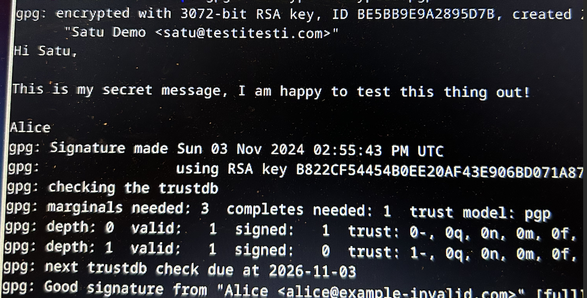
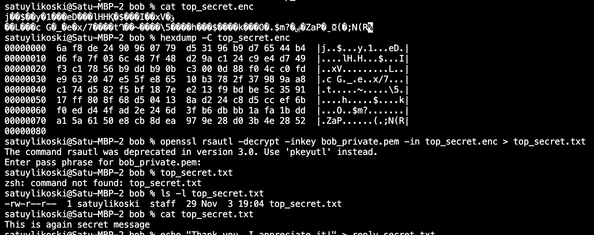
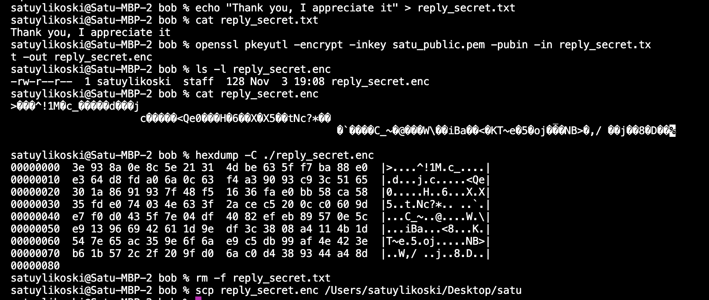
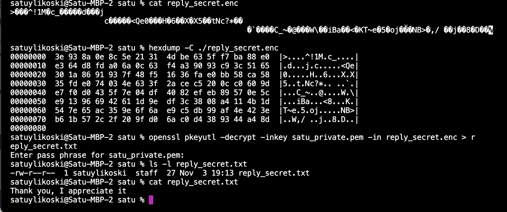

# H2 assignment

## X. Summaries

#### **[Schneier 2015: Applied Cryptography](https://learning.oreilly.com/library/view/applied-cryptography-protocols/9781119096726/10_chap02.html#chap02-sec004):**

**2.5 Communications Using Public-Key Cryptography**

- Public-key cryptography means having a key pair which can be used to encrypt and decrypt content. With the public key the content can be encrypted and it can only be decrypted with the matching private key. Public-key cryptography is asymmetric.
- Symmetric-key cryptography means encrypting and decrypting the content with the same algorithm and key. Symmetric-key cryptography is much faster and less vulnerable than public-key cryptography.
- Hybrid cryptosystem is a combination of public-key cryptography and symmetric-key cryptography: Public key (A) is being used to encrypt another key (B), and B is being used to encrypt the content. Both the content and the B will be sent to recipient. In order to read the content, private key is used to decrypt the B and finally with decrypted B the content can also be decrypted.

**2.6 Digital signatures**

- Documents could be signed digitally with a system between the person who signed and the recipient. The person who signed, would encrypt the document with public key, the system would decrypt it with matching private key, encrypt it again with another public key, which private key the recipient has. The system between would be not only slow but vulnerable in the long run since it would contain a lot of sensitive information the more documents get signed.
- Faster and safer solution would be to use hashes of the documents and send it straight to the recipient without the decryption and encryption in between. Public-Key Cryptography would be used to encrypt and decrypt the hash.

**2.7 Digital signatures with encryption**

- Integrating digital signatures with public-key cryptography makes a protocol that ensures both encrypted security and verified authenticity.
- Two key pairs would be used: One for signing and verifying the signature and one to encrypt and decrypt the signed message.

**2.8 Random And Pseudo-Random-Sequence Generation**

- Issue with a random-number generator is it doesn't produce a random sequence. Random-number generators are periodic and periodic means predictable.
- A pseudo-random sequence generator produces sequences that appear random but are generated by a deterministic process. To be effective, these sequences should not repeat over short lengths and should resemble true randomness in properties like bit distribution, run lengths, and unpredictability, which can be statistically tested to ensure they meet randomness criteria.
- A sequence generator is pseudo-random if the generated sequence looks random so that it passes the statistical tests of randomness.
- In order sequence to be cryptographically secure pseudo-random it should also be unpredictable and computationally infeasible to predict the upcoming random bits.
- According to O'reilly, The sequence is real random only if it also cannot be reliably reproduced.

#### **[Rosenbaum 2019: Grokking Bitcoin](https://learning.oreilly.com/library/view/grokking-bitcoin/9781617294648/OEBPS/Text/kindle_split_011.html#ch02lev1sec1):**

- Digital signature contains three phases: Preparation, signing and verifying. Preparation contains creating the private and public key (and handing over the public key), signing contains creating the sign with the private key, and verifying contains checking the signature with the public key.
- A key pair is created once but it can be used several times
- A key pair can be created by first creating a private key. The private key is a large secret random number. The public key will be calculated from the private key.
- "Hello" => encrypted with the private key => "asks398fja8212jdwc" => decrypted with the public key => "Hello"
- The keys can be used both ways: The content can also be encrypted with the public key.
- Digital signatures could be attacked by stealing the private key and behaving like the original owner of the private key.

#### **[Karvinen 2023: PGP - Send Encrypted and Signed Message - gpg](https://terokarvinen.com/2023/pgp-encrypt-sign-verify/):**

- gpg = GNU privacy guard, generally used to encrypt messages
- Gpg can be used in command line but also via additional tools for everyday messaging
- The article also shows an example of sending a encrypted message between two people via command line tools

## a) Pubkey today

An example of how I have used public key cryptography today:

- Chatting with my friend in Whatsapp
- When I sent the message, it got encrypted asymmetrically. The message was mixed up using m friend's magic lock (public key) before it got sent over the internet. My friend decrypted it with matching private key. ([Nayak, A, 8.2.2024: Asymmetric Encryption — Whatsapp mechanism](https://medium.com/@anoopnayak1/asymmetric-encryption-whatsapp-mechanism-79d1821e765c#:~:text=When%20you%20send%20a%20message,can%20unlock%20and%20read%20it.))

## b) Messaging

I was able to use PGP to encrypt, send and decrypt the message. Here's a picture to proof:

## c) Other tool

I used OpenSSL. Satu sent a message to Bob and Bob responded. Here's all the steps I took:

1. I used OpenSSL's genrsa command to generate a 1024-bit public/private key pair for both, Satu and Bob.
2. I extracted public keys from both parties into a file, satu_public.pem and bob_public.pem. Private keys were kept secret.
3. Satu and Bob shared their public keys with each other. I used `scp` command for this
4. Satu had a message for Bob in a text file (top_secret.txt), she encrypted it with Bob's public key and saved it in separated file (top_secret.enc). She also deleted the original text file to be sure.
5. Satu sent the encrypted message to Bob (used `scp` again for this)
6. Bob received the message, decrypted it with his private key so he was able to see it:

7. Bob wanted to respond, so he wrote his message into reply_secret.txt file, encrypted it with Satu's public key and stored it into reply_secret.enc file, also deleted the original message file. Then he sent it to Satu:

8. Satu received the response, decrypted it with her private key and was able to read it:

My comments: I feel like OpenSSL is very safe tool to encrypt the files. Additional layer of security was a passphrase that was created when the key pair got created. Whenever the private key was being used, the passphrase was needed to input first. My only worry is the step when the public keys get sent to each other, someone could perhaps steal it and decrypt the messages.

Reference: [Kamathe, G, 29.4.2021: Encrypting and decrypting files with OpenSSL](https://opensource.com/article/21/4/encryption-decryption-openssl)

## d) Eve and Mallory

PGP protecting against passive eavesdroppers and active interferers:

1. Eve, Passive eavesdropper

- Symmetric encryption is being used for message content and asymmetric encryption for the session key => Only the intended recipient will be able to read the content
- Every user has a public and a private key => secure transmission of messages withot exposing the content

2. Mallory, Active interferer

- Message's integrity and authenticity can be verified with digital signatures => signature won't validate if altered
- Modifications of the messages can be marked with hash functions => will notice if some unwanted modifications happen

Reference: OpenAI's ChatGPT. (2023). Explanation of PGP security mechanisms. Accessed: 3.11.2024.

## f) Password management (e part missing?)

I used KeePass XC since I've been using it in the past.

1. Download KeePass from their website
2. Open the app, create a database and add a strong password. This password should be long and hard to guess since all the rest of the passwords will be stored behind it in the system. :)
3. By clicking "Add entry" you can store new passwords. If you click the dice in the password field, KeePass XC gives you a random password with the rules you want.
4. After adding the passwords in the system you only need to rememeber the password to the KeePass XC and all the other services can have secure, hard-to-guess and rather unique passwords.

A couple of benefits came to my mind:

- With password manager, the passwords can be long and complicated since the user does not need to remember it. Also this way user won't use his/her personal information as a part of the password, such as birthdate or phone number etc. This makes password guessing harder for attacker
- If the passwords weren't different in every system, one breach could give an attacker the access to the rest of the services as well
