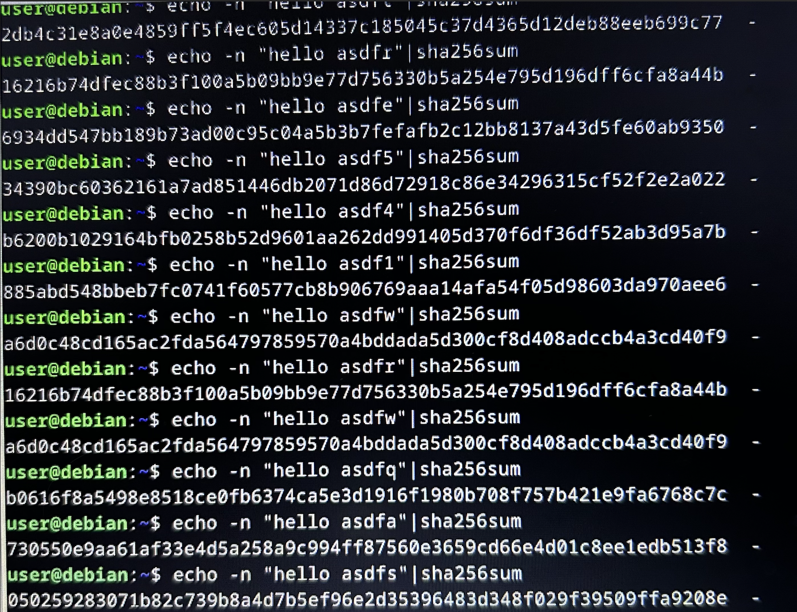
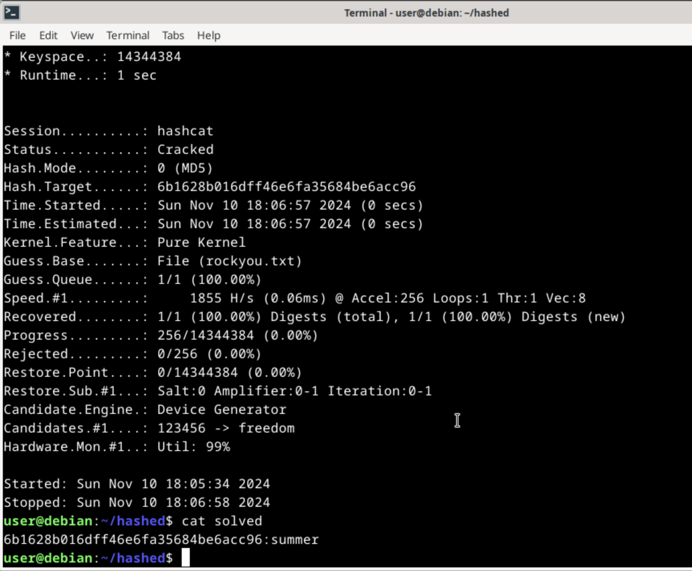

# H3 assignment

## X. Summaries

#### **[Schneier 2015: Applied Cryptography](https://learning.oreilly.com/library/view/applied-cryptography-protocols/9781119096726/10_chap02.html#chap02-sec004):**

**2.3 One-way Fuctions**

- One-way functions are crucial in public-key cryptography, they are easy to compute but it's very difficult (almost impossible..) to reverse (like breaking a plate)
- A trapdoor one-way function is a one-way function with a twist: it is yet very hard to reverse unless you know the hidden secret (trapdoor). With the secret reversing is as easy as computing

**2.4 One-Way Hash Functions**

- One-Way hash function means the same as compression function, contraction function, message digest, fingerprint, cryptographic checksum, message integrity check (MIC) and manipulation detection code (MDC)
- Hash function means converting a string (=pre-image) into fixed-length output string (=hash value)
- A message authentication code (MAC) is a one-way hash function with an addition of secret key: Someone who has the secret key, can vrify the hash value.

Reference: Schneier 2015. Applied Cryptography. URL: https://learning.oreilly.com/library/view/applied-cryptography-protocols/9781119096726/10_chap02.html#chap02-sec004. Accessed: 10 November 2024.

#### **[Karvinen 2020: Cracking Passwords with Hashcat](https://terokarvinen.com/2022/cracking-passwords-with-hashcat/):**

- Instead of storing original passwords, systems store the hash of them
- Hashcat is a hash cracking program

Reference: Karvinen 2020. Cracking Passwords with Hashcat. URL: https://terokarvinen.com/2022/cracking-passwords-with-hashcat/. Accessed: 10 November 2024.

## a. Billion dollar busywork

I manually tried quite many different combinations but finally the word "hello asdfs" created a hash that started with zero.



## b) Compare hash

I created a file and made a hash of it. Created hash was:
`c5f96b8b456c0e432ea3f63eaf68c64c555c38bb2eb838710675d296f002cfc7`.
I changed one letter (dot to question mark) in a file and the new hash was:
`78a893ede6f156e0a4aacb1125a0de15dfda7ed6b034a60f8e9f7d5c6872f7ba`
Now when comparing the hashes, they are totally different. I cannot find any similarities between them.

## c) Hashcat

I installed Hashcat and practised like in the article mentioned in the summary section. Heres the proof



## d) Dictionary attack

I used Hashcat to crack the hash with the following command:

```
hashcat -m 0 '21232f297a57a5a743894a0e4a801fc3' rockyou.txt -o solved
```

After that I ran a command cat solved. And the answer seems to be "admin"

```
21232f297a57a5a743894a0e4a801fc3:admin
```

## e) How can you make a password that's protected against a dictionary attack?

I was thinking of how well using sha256sum would protect the password. I created a hash out of word summer:

```
echo -n 'summer'|sha256sum
```

Hash created was:

```
e83664255c6963e962bb20f9fcfaad1b570ddf5da69f5444ed37e5260f3ef689
```

I checked the hash id with command:

```
hashid -m e83664255c6963e962bb20f9fcfaad1b570ddf5da69f5444ed37e5260f3ef689
```

and got this result:

```
Analyzing 'e83664255c6963e962bb20f9fcfaad1b570ddf5da69f5444ed37e5260f3ef689'
[+] Snefru-256
[+] SHA-256 [Hashcat Mode: 1400]
[+] RIPEMD-256
[+] Haval-256
[+] GOST R 34.11-94 [Hashcat Mode: 6900]
[+] GOST CryptoPro S-Box
[+] SHA3-256 [Hashcat Mode: 5000]
[+] Skein-256
[+] Skein-512(256)
```

I probably need to use the Hashcat mode 1400 so I ran this command:

```
hashcat -m 1400 'e83664255c6963e962bb20f9fcfaad1b570ddf5da69f5444ed37e5260f3ef689' rockyou.txt -o solved
```

After a while hashcat was able to solve the hash successfully. Running `cat solved` gave me an answer

```
e83664255c6963e962bb20f9fcfaad1b570ddf5da69f5444ed37e5260f3ef689:summer
```

So, even sha256 did not help when the password itself is weak. My answer to this question is that in order to create as strong password as possible against the dictionary attack is to use a password manager, such as KeePass, and use it to create a random password that will not have any recognizable word (like "summer").
